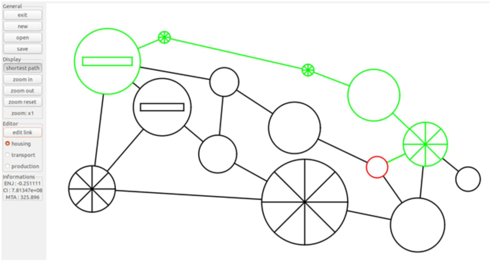

# Island City Builder



## Project Overview

Island City Builder is an application developed to design and simulate island cities interconnected by bridges. Each city can incorporate three distinct types of buildings: houses for residents, production sites for workplaces, and transport nodes to enhance connectivity. The application allows users to create, save, and load these city layouts, checking for logical consistency.

## Features

- **City Design**: Users can add houses, production sites, and transport nodes to their city layouts and choose their size and location.
- **Save/Load Functionality**: Cities can be saved to and loaded from formatted files.
- **Metrics Evaluation**: The application evaluates cities based on the following metrics:
  - Average distance to nearest production site.
  - Balance between residential and work areas.
  - Total population capacity.

## Context

This project was created as part of the Object-Oriented Programming course in the first year at EPFL (École Polytechnique Fédérale de Lausanne) during the Spring semester of 2020, utilizing C++ as the programming language.

## Getting Started

To run the Island City Builder, follow these steps:

1. **Clone the Repository:**
```bash
    git clone [repository-url](https://github.com/yseoo/Archipelago)
    cd Archipelago
```
2. **Compile the Application:**
```bash
   cd compil/
   make
```
3. **Run the Application:**
```bash
   ./projet
```

## Dependencies

- g++ (or any C++ compiler)
- make
- gtkmm-3.0

(This project was developed on Ubuntu. If you are using a different operating system, you may need to install additional dependencies.)